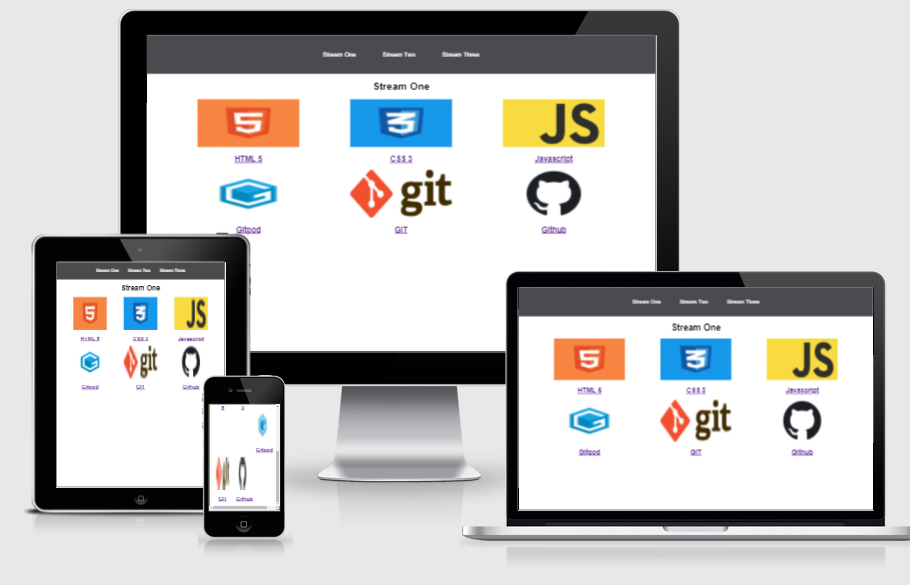

# My First Gitpage

<a href="https://babyoblong.github.io/my-full-template/index.html"> View the live project here</a>

This is the beginning of my journey into the CLI, Git and Github. It is a reminder of where I started and will also serve as a reference in the future.

At the end of the this project I should be able to use the CLI, Git, GitHub and Gitpod efficiently to produce the results that are required.

## User Experience
---

## Technologies Used
---

* HTML5 
* CSS3
* HTML Markdown
